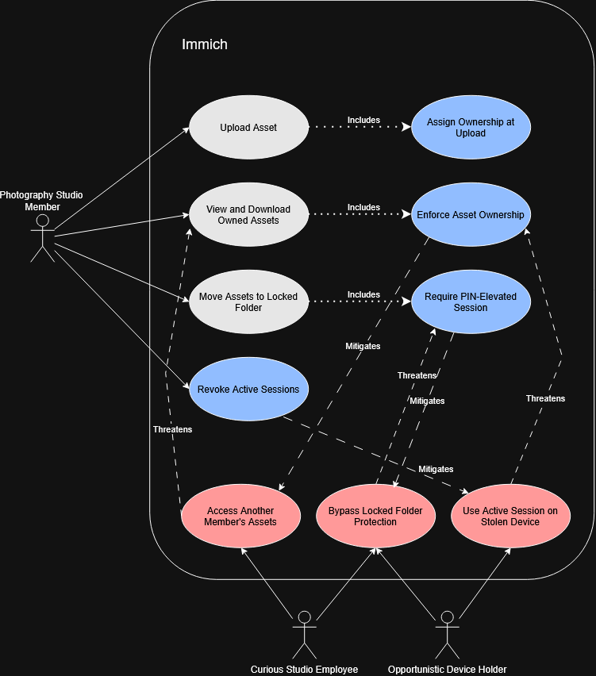

# Immich Use Case and Misuse Case Security Analysis

## Team Members

- Christian Theisen
- Adu
- Marc
- Matthew
- Dillon

---

## 1. Operational Context

This analysis builds upon the operational environment established in our project proposal for Immich. The system of interest is a self-hosted Immich deployment used by a five-person photography studio to manage, store, and share photos and videos.

### 1.1 System and Trust Boundaries

The security analysis considers interactions across the following system and trust boundaries:

- Internet
- Reverse proxy
- Immich application
- PostgreSQL database
- File storage
- External identity provider, where applicable

The PostgreSQL database and file storage are treated separately because the database contains application metadata and authentication-related information, while original photos and videos reside in file storage.

---

## 2. Essential Interactions and Use/Misuse Case Analysis

Five essential interactions between Immich and its operational environment were selected for use-case and misuse-case analysis.

### 2.1 Authentication and Login

**Owner:** Christian

#### Actors

**Photography Studio Member:** A member of the five-person photography studio who has an existing Immich account and uses the externally accessible Immich application to access the studio's photo-management functionality.

#### Use Case Description

The Authentication and Login use case represents a photography studio member accessing Immich using an existing account. The Photography Studio Member provides an email address and password through the Immich login interface. Immich validates the submitted credentials before granting authenticated access to the user's account and protected application functionality.

**Goal:** Authenticate to Immich and gain access to the member's authorized account and photo-management functionality.

**Precondition:** The Photography Studio Member has an existing Immich account with valid login credentials.

**Successful Outcome:** Immich validates the supplied credentials and establishes authenticated access for the Photography Studio Member.

#### Initial Use Case

The initial use-case analysis identified **Log In with Email and Password** as the primary interaction. The Photography Studio Member interacts with the Immich system through this use case to establish authenticated access.

The initial diagram intentionally represents only the legitimate interaction. Misusers, misuse cases, and security countermeasures are introduced during subsequent iterations of the analysis.

#### Misuser(s)

**External Credential Attacker:** An individual outside the photography studio who has network access to the studio's Internet-accessible Immich login interface. The attacker's motive is to obtain unauthorized access to a studio member's account and the photographs, metadata, or other resources available through that account. The attacker does not initially possess legitimate access to Immich but may obtain or discover a studio member's credentials through an external source, such as credential reuse or prior credential theft. The attacker can submit authentication requests through the same externally accessible login interface used by legitimate studio members.

#### Misuse Cases

**Gain Unauthorized Account Access:** The External Credential Attacker attempts to authenticate as a legitimate Photography Studio Member without authorization. This misuse case threatens the normal **Log In with Email and Password** use case.

**Use Stolen or Reused Credentials:** The External Credential Attacker submits credentials belonging to a legitimate Photography Studio Member. Because the supplied credentials may be valid, ordinary credential validation alone may not distinguish the attacker from the legitimate account owner. This misuse case therefore threatens the **Validate Login Credentials** security functionality.

#### Security Countermeasures

**Validate Login Credentials:** Immich validates the email address and password supplied during authentication before granting authenticated access. This security functionality mitigates attempts to gain unauthorized account access when an attacker supplies invalid credentials.

The analysis also identified a limitation of credential validation. If an attacker obtains valid credentials belonging to a Photography Studio Member, successful password validation alone cannot determine whether the person submitting those credentials is the legitimate account owner. This limitation motivated an additional misuse case rather than assuming that credential validation completely prevents unauthorized access.

#### Iterative Analysis

The Authentication and Login analysis was developed recursively by introducing threats and security functionality across multiple iterations.

**Initial Use Case:** The analysis began with the Photography Studio Member interacting with **Log In with Email and Password**. This established the legitimate interaction between an external actor and Immich.

**Iteration 1 – Unauthorized Account Access:** An **External Credential Attacker** and the misuse case **Gain Unauthorized Account Access** were introduced. The misuse case threatens the legitimate login use case and represents an external attacker attempting to authenticate as a studio member without authorization.

**Iteration 2 – Credential Validation:** The security functionality **Validate Login Credentials** was introduced. The **Log In with Email and Password** use case includes credential validation, which mitigates unauthorized-access attempts involving invalid credentials.

**Iteration 3 – Stolen or Reused Credentials:** The analysis was repeated against the newly identified security functionality. The misuse case **Use Stolen or Reused Credentials** was introduced because an attacker possessing valid credentials may successfully satisfy ordinary credential validation. This misuse case therefore threatens **Validate Login Credentials** and demonstrates that password validation does not completely eliminate the risk of account compromise.

The final diagram incorporates the legitimate actor, contextualized misuser, identified misuse cases, and security functionality discovered through this iterative process.

#### Final Use/Misuse Case Diagram

The final diagram incorporates the legitimate Authentication and Login interaction, the External Credential Attacker, the identified misuse cases, and the security functionality derived through iterative analysis.

#### Derived Security Requirements

The iterative misuse-case analysis produced the following functional security requirements for Authentication and Login:

- **SR-AUTH-01 – Credential Validation:** Immich shall validate the email address and password supplied by a user before establishing an authenticated session or granting access to protected application functionality.

- **SR-AUTH-02 – Authentication Failure:** Immich shall deny authentication when the supplied email address or password cannot be successfully validated.

- **SR-AUTH-03 – Authentication Failure Disclosure:** Immich shall avoid revealing whether an authentication failure resulted from an invalid email address or an invalid password, reducing information available for account-enumeration attacks.

- **SR-AUTH-04 – Authentication Event Logging:** Immich shall record failed authentication attempts with sufficient information to support security monitoring and investigation.

- **SR-AUTH-05 – Compromised Credential Risk:** Authentication controls should provide a means of reducing reliance on reusable application passwords because possession of a valid studio member's password may allow an unauthorized user to satisfy ordinary password validation.

#### Immich Implementation Evidence

The derived Authentication and Login requirements were compared against the current Immich implementation and official documentation.

| Requirement | Support | Immich Implementation Evidence |
| --- | --- | --- |
| **SR-AUTH-01** | Supported | Immich's authentication service retrieves the user by email and compares the submitted password with the stored password hash using bcrypt. A successful authentication results in creation of the login response and session. |
| **SR-AUTH-02** | Supported | If the user does not exist, has no password, or the password comparison fails, Immich rejects the request with an unauthorized response rather than establishing a session. |
| **SR-AUTH-03** | Supported | Immich returns the same "Incorrect email or password" response for unsuccessful password authentication. It also performs a bcrypt comparison against a dummy hash when an email is not registered to reduce timing-based user enumeration. |
| **SR-AUTH-04** | Supported | Immich records a warning for a failed login attempt containing the submitted email address and source IP address. |
| **SR-AUTH-05** | Partially Supported | Immich supports third-party authentication through OpenID Connect (OIDC) on top of OAuth2 and allows administrators to disable local password authentication. This provides a deployment option that can reduce reliance on Immich-managed reusable passwords. However, ordinary email/password authentication still relies on possession of valid credentials and does not by itself distinguish a legitimate user from an attacker who has obtained those credentials. |

Overall, Immich directly supports the credential-validation, authentication-failure, failure-disclosure, and failed-login logging requirements identified by this analysis. The compromised-credential requirement is only partially addressed by the availability of OAuth/OIDC and the ability to disable password authentication. The strength of authentication provided by an external identity provider depends on that provider's configuration and security controls.

---

### 2.2 Upload and Private Asset Access

**Owner:** Matthew

#### Actors

**Studio Member:** A member of the photography studio who has an authenticated Immich account and uses the Immich mobile or web app to upload photos from client shoots and to view, download, and organized any assets they own. Studio members rely on Immich to keep unfinished assets and personal photos visible only to the uploading member until that member shares them intentionally. 

#### Use Case Description

The Upload and Private Asset Access use case represents a Photography Studio Member adding new photos to Immich and then accessing their own private media. The member uploads photos/videos through the Immich client, Immich then stores the data, records the member as the owner of the asset, and processes it in the background. The studio member can then view, download, and organize their assets, and move any sensitive assets into a locked folder.

**Goal:** Upload photos to Immich and access assets owned by the requesting authenticated member while preventing access by other users of the same instance.

**Precondition:** The Studio Member is authenticated to Immich with an active session. 

**Successful Outcome:** Immich stores the uploaded asset under the member's ownership and returns only assets the member is authorized to access.

#### Initial Use Case

Initial use-case analysis identified three main interactions: **Upload Asset, View and Download Owned Assets, and Move Assets to Locked Folder.** The Studio Member interacts with Immich for all three.

#### Misuser(s)

**Curious Studio Employee:** An employee that holds a legitimate authenticated Immich account on the same instance. The employee's motive is to view a colleague's unreleased work or personal photos out of curiosity or competitive interest. 

Because the employee is already successfully authenticated, credential-based access controls don't apply in this situation. The Employee's resources are simple: A web broswer, developer tools, and Immich's REST API, which is publicly documented. 

The attack of choice is to bypass the client interface and request asset identifiers belonging to another member, assuming that the app filters content only in the user interface. 

**Opportunistic Device Holder:** Someone that has obtained a studio member's phone that was either lost or stolen. The motive is to access private photos or videos for extortion or resale. The device holder has no credentials but has an active Immich session on the downloaded mobile app, which gives them the same access as the legitimate owner of the account. 

The attack of choice is to simply open the app and browse/download the legitimate member's assets, including whatever assets the user thought were protected by the Locked Folder.

#### Misuse Cases

**Access Another Member's Private Assets:** The curious studio employee requests assets owned by a different studio member by providing that member's asset identifiers directly to the API. This misuse case threatens the View and Download Own Assets use case.

**Use an Active Session on a Stolen Device:** The opportunistic device holder goes through a session that Immich considers legitimate. Because the request has the legitimate owner's identity, ownership-based authorization can't tell the device holder from the legitimate member, this case threatens the Enforce Asset Ownership security functionality. 

**Bypass Locked Folder Protection:** Either of the misusers attempts to reach assets that are marked as locked without satisfying the PIN requirement.

For example, they could do so by requesting an endpoint that returns assets without applying the locked-visibility restriction. This case threatens the Require PIN-Elevated Session security functionality. 

#### Security Countermeasures

**Assign Ownership at Upload:** Immich assigns the authenticated uploader as the owner of each newly created asset rather than accepting an owner identifier from the client. This establishes the ownership relationship that all authorization decisions later on depend on.

**Enforce Asset Ownership:** Immich does a server-wide authorization check for any requested asset identifier, confirming that the authenticated user owns or has been granted access to the asset. This mitigates attempts to access another member's assets through identifiers. 

Analysis also found a limitation of ownership enforcement. Because the authorization check resolves the identity carried by the session, it can't distinguish between the legitimate owner from someone that possesses the owner's device. 

**Require PIN-Elevated Session:** Assets stored in the Locked Folder can be accessed only by a session that has been elevated by entering the account PIN, and that elevation expires after a timed period, introducing a second authorization factor inside of an already-authenticated account.

**Revoke Active Sessions:** Immich allows users to list the sessions associated with their account and devices and revoke them individually or all at once, so a lost device can be cut off without having to change account credentials. 

#### Iterative Analysis

**Initial Use Case:** Analysis began with the Photography Studio Member interacting with Upload Asset, View and Download Owned Assets, and Move Assets to Locked Folder.

**Iteration 1 - Insider Access to Private Assets:** The Curious Studio Employee and the misuse case Access Another Member's Private Assets were introduced. This misuse case threatens the legitimate asset-access use case.

**Iteration 2 - Ownership Enforcement:** Security functions Assign Ownership at Upload and Ownership Enforcement were introduced. Upload Asset includes the ownership assignment and View and Download Owned Assets includes the ownership check, mitigating insider access using identifiers.

**Iteration 3 - Stolen Device Sessions:** Analysis was repeated against the newly identified security functionality. The opportunistic device holder and the misuse case Use an Active Session on a Stolen Device were introduced because a request made from the legitimate owner's device will satisfy the ownership enforcement. This case threatens Enforce Asset Ownership and shows that ownership checking won't protect assets if a session is compromised. 

**Iteration 4 - Session Revocation and PIN Elevation:** Revoke Active Sessions and Require PIN-Elevated Session were introduced to mitigate the stolen session misuse case. These countermeasures allow a member to terminate a compromised session and further secure their most sensitive assets. 

**Iteration 5 - Locked Folder Bypass:** Analysis was repeated against PIN control. The misuse case Bypass Locked Folder Protection was introduced because the locked-visibility restriction should be applied consistently by every endpoint that returns assets. If any endpoint does not apply the restriction, a misuser can reach locked assets from a session that never entered the account PIN. This case threatens Require PIN-Elevated Session and created a requirement for default-deny enforcement instead of per-endpoint enforcement. 

The final diagram incorporates the legitimate actor, the two misusers, the three misuse cases, and the four security functions discovered through the iterative analysis. 

#### Final Use/Misuse Case Diagram

#### Derived Security Requirements

The iterative analysis produced these security requirements for Upload and Private Asset Access:

**SR-ASSET-01 - Ownership Assignment:** Immich will assign the authenticated uploading user as the owner of each newly uploaded asset and will not accept a client provided ownership identifier.

**SR-ASSET-02 - Server-Side Authorization:** Immich will verify for every requested asset identifier that the authenticated user is authorized to access the asset before providing any metadata, thumbnails, or original files regardless of any filtering done by the client.

**SR-ASSET-03 - Authorization Failure:** Immich will deny requests for any assets the user is not authorized to access, without telling if the requested identifier exists or not.

**SR-ASSET-04 - Session Revocation:** Immich will allow a user to view and revoke any active sessions associated with their account, so that access from a lost or stolen device can be terminated.

**SR-ASSET-05 - Secondary Authorization for Sensitive Assets:** Immich will restrict access to assets marked as locked to sessions that have been elevated using the account PIN, and will expire that elevation after a set period.

**SR-ASSET-06 - Consistent Visibility Enforcement:** Immich will apply the locked-visibility restriction by default across all endpoints that return assets, instead of relying on each endpoint to set the restriction individually. 

#### Immich Implementation Evidence

| Requirement | Support | Implementation Evidence |
| ---------- | ---------- | ----------|
| SR-ASSET-01 | Supported | Immich sets the authenticated uploader as the asset owner at creation; ownership is the same in postgreSQL, which is where information on access/authorization, users, and assets is stored. |
| SR-ASSET-02 | Supported | Authorization is centralized in server/src/utils/access.ts. Controllers then call requireAccess with a permission and requested IDs resolved against repositories/access.repository.ts |
| SR-ASSET-03 | Supported | The access check runs before the request handler, so unauthorized identifiers are rejected before they are confirmed. |
| SR-ASSET-04 | Supported | Sessions are listed and revocable per device in the user settings. Release v3.1.0 added the option to invalidate sessions on password reset |
| SR-ASSET-05 | Supported | The Locked Folder is advertised as extra protection for sensitive media, it uses a server-side PIN and session elevation. |
| SR-ASSET-06 | Partially Supported | Elevation is enforced per handler. A study done in 2026 found that 4 out of 5 of the endpoints enforced the PIN requirement, while POST /search/random didn't. leaving out the visibility field returned assets that were supposed to be locked to a session that never entered the PIN. |

Immich supports the Ownership, Authorization, Authorization Failure, Session Revocation, and PIN-Elevation. Consistent Visibility Enforcement is only partially addressed and supported. Ownership checks are centralized but the visibility restriction is applied individually, endpoint to endpoint. 

---

### 2.3 Shared Albums and Public Links

**Owner:** Dillon

#### Actors

**Photography Studio Member:** A staff member at the photography studio who uses Immich to organize photos and create public shared links for delivering selected photos to clients.

**Client:** A customer of the photography studio who receives a public shared link and uses it to access photos intentionally shared by the studio.

#### Use Case Description

The Shared Albums and Public Links use case represents a Photography Studio Member using Immich to share selected photos with a client through a public link. The Studio Member selects the photos that should be shared and creates a public link that can be sent to the Client. The Client can then use the link to access the shared photos without needing an Immich account.

**Goal:** Allow a Photography Studio Member to securely share selected photos with a Client without exposing other private photos stored in Immich.

**Precondition:** The Photography Studio Member is logged into Immich and has access to the photos that will be shared.

**Successful Outcome:** Immich creates a public share that allows the Client to access the intended photos while following the sharing restrictions set by the Studio Member.

#### Initial Use Case

The initial use-case analysis identified **Create Public Share** and **Access Shared Photos** as the primary interactions. The Photography Studio Member creates a public share containing selected photos, and the Client uses the resulting link to access the shared content.

The initial analysis represents the intended sharing interaction before misuse cases and security countermeasures are introduced.

#### Misuser(s)

**Unauthorized Shared-Link Holder:** Someone who gets access to a public shared link even though the photos were not meant for them. The link could have been forwarded to them or exposed in some other way. They could then try to use the link to view photos without permission. This person does not have a studio account but can still reach Immich's public sharing page through the link.

#### Misuse Cases

**Access Shared Content Without Authorization:** An Unauthorized Shared-Link Holder gets a public link that was meant for a Client and tries to use it to view the shared photos. This threatens the normal **Access Shared Photos** use case because someone who was not supposed to receive the link could potentially use it to view the content.

**Access Photos Using Expired Link:** An Unauthorized Shared-Link Holder tries to access the shared photos after the link was supposed to expire. This also threatens **Access Shared Photos** because a link that is no longer valid should not continue giving someone access to the photos.

#### Security Countermeasures

**Password-Protected Shared Link:** Immich allows the Studio Member to add a password to a public shared link. This adds another layer of protection because having the link by itself is not enough to access the photos. The person opening the link also needs to provide the correct password.

**Set Share Expiration:** Immich allows the Studio Member to set an expiration time for a public shared link. Once that time has passed, the link should no longer allow access to the shared photos. This helps prevent old links from continuing to provide access longer than the Studio Member intended.

#### Iterative Analysis

The Shared Albums and Public Links analysis was built by starting with the normal sharing process and then looking at ways that process could be misused.

**Initial Use Case:** The analysis started with the Photography Studio Member creating a public share and the Client using the link to access the selected photos. This represents how the sharing feature is supposed to work normally.

**Iteration 1 – Unauthorized Shared Access:** The **Unauthorized Shared-Link Holder** was introduced along with the **Access Shared Content Without Authorization** misuse case. This represents someone getting a shared link that was not intended for them and attempting to use it to view the photos.

**Iteration 2 – Password Protection:** The **Password-Protected Shared Link** security feature was added as a countermeasure. Requiring a password gives the shared link another layer of protection so that simply getting the link may not be enough to access the photos.

**Iteration 3 – Expired Link Access:** The **Access Photos Using Expired Link** misuse case was then added to represent someone attempting to continue using a shared link after the Studio Member intended for access to end.

**Iteration 4 – Share Expiration:** The **Set Share Expiration** security feature was added to address this misuse case. Setting and enforcing an expiration time limits how long the shared link can continue to provide access.

The final diagram shows the normal sharing process along with the two misuse cases and the security features that help address them.

#### Final Use/Misuse Case Diagram

The final diagram shows the Photography Studio Member and Client using Immich's public sharing feature, along with the Unauthorized Shared-Link Holder, the two identified misuse cases, and the security features added to address those threats.

#### Derived Security Requirements

The misuse-case analysis produced the following security requirements for Shared Albums and Public Links:

- **SR-SHARE-01 – Shared-Link Password Protection:** Immich shall require the correct password before allowing access to a password-protected public share.

- **SR-SHARE-02 – Invalid Shared-Link Password:** Immich shall deny access when an incorrect password is provided for a password-protected public share.

- **SR-SHARE-03 – Shared-Link Expiration:** Immich shall prevent access to a public shared link after its configured expiration time has passed.

- **SR-SHARE-04 – Expiration Validation:** Immich shall check whether a public shared link has expired before allowing access to the photos associated with that link.

#### Immich Implementation Evidence

Immich already includes several protections that line up with the security requirements identified in this analysis. The public sharing documentation and source code were reviewed to see how each requirement is handled.

| Requirement | Status | How Immich Addresses It |
|---|---|---|
| SR-SHARE-01 | Implemented | Public shared links in Immich can be protected with a password. When password protection is enabled, the correct password must be provided before the shared content can be accessed. |
| SR-SHARE-02 | Implemented | Immich checks the password submitted for a protected share. If the password is incorrect, access to the share is rejected. |
| SR-SHARE-03 | Implemented | A public share can be given an expiration date. After that expiration time is reached, the shared link is no longer treated as valid. |
| SR-SHARE-04 | Implemented | When a shared link is validated, Immich checks its expiration information. The link remains valid if no expiration was set or if the expiration time has not been reached. |

Overall, the protections identified in the misuse-case analysis are already represented in Immich. Password protection helps limit access when a link reaches someone it was not intended for, while expiration dates limit how long a shared link can continue providing access. Together, these features address the two misuse cases identified in the diagram.

---

### 2.4 Administrative Access and User Management

**Owner:** Marc

#### Actors

TBD

#### Use Case Description

TBD

#### Initial Use Case

TBD

#### Misuser(s)

TBD

#### Misuse Cases

TBD

#### Security Countermeasures

TBD

#### Iterative Analysis

TBD

#### Final Use/Misuse Case Diagram

*Diagram to be added.*

#### Derived Security Requirements

TBD

#### Immich Implementation Evidence

TBD

---

### 2.5 OAuth/OIDC and External Authentication

**Owner:** Adu

#### Actors

TBD

#### Use Case Description

TBD

#### Initial Use Case

TBD

#### Misuser(s)

TBD

#### Misuse Cases

TBD

#### Security Countermeasures

TBD

#### Iterative Analysis

TBD

#### Final Use/Misuse Case Diagram

*Diagram to be added.*

#### Derived Security Requirements

TBD

#### Immich Implementation Evidence

TBD

---

## 3. Consolidated Security Requirements

The following table consolidates the functional security requirements derived from the five misuse-case analyses and maps them to the threats and security controls that motivated them.

| ID | Security Requirement | Derived From | Security Property / Control | Immich Support | Evidence |
|---|---|---|---|---|---|
| SR-AUTH-01 | TBD | Authentication/Login | TBD | TBD | TBD |
| SR-ASSET-01 | TBD | Private Asset Access | TBD | TBD | TBD |
| SR-SHARE-01 | TBD | Shared Links | TBD | TBD | TBD |
| SR-ADMIN-01 | TBD | Administrative Access | TBD | TBD | TBD |
| SR-OIDC-01 | TBD | OAuth/OIDC | TBD | TBD | TBD |

---

## 4. AI-Assisted Use/Misuse Case Analysis

### 4.1 Prompt Used

TBD

### 4.2 Suggestions Produced

TBD

### 4.3 Improvements Made to the Diagrams

TBD

### 4.4 Usefulness and Limitations

TBD

---

## 5. Alignment with Immich Security Features

### 5.1 Supported Security Requirements

TBD

### 5.2 Partially Supported Security Requirements

TBD

### 5.3 Identified Security Gaps

TBD

### 5.4 Sufficiency of Existing Security Features

TBD

---

## 6. Security Configuration and Installation Documentation Review

### 6.1 Existing Security Guidance

TBD

### 6.2 Missing or Unclear Security Guidance

TBD

### 6.3 Recommended Documentation Improvements

TBD

---

## 7. Project Management and Collaboration

### 7.1 GitHub Project Board

[Immich Project Board](ADD_PROJECT_BOARD_LINK_HERE)

### 7.2 Team Task Assignments

| Team Member | Primary Responsibility | Secondary Responsibility |
|---|---|---|
| Christian | Authentication/Login | Report integration and project board |
| Matthew | Upload and Private Asset Access | Implementation verification |
| Dillon | Shared Albums and Public Links | Security requirements compilation |
| Marc | Administrative Access and User Management | Diagram consistency review |
| Adu | OAuth/OIDC and External Authentication | Security documentation review |

### 7.3 Team Collaboration

TBD

---

## 8. Team Reflection

### Christian Theisen

For this assignment, I was responsible for the Authentication and Login use/misuse case analysis and helped organize the team's work through the GitHub Project Board. I created the project issues for the five essential interactions and used a separate branch and pull request for my analysis so that the work could be reviewed before being merged into the main report.

My analysis began with the legitimate interaction between a Photography Studio Member and Immich's email/password login functionality. I then iteratively introduced an External Credential Attacker, unauthorized account access, credential validation, and the threat created by stolen or reused credentials. One of the most useful parts of this process was recognizing that a security control can itself become the subject of another misuse case. Although validating credentials mitigates attempts involving incorrect credentials, it cannot by itself distinguish a legitimate user from an attacker who possesses valid stolen credentials.

I also compared the security requirements derived from the analysis with Immich's current source code and official documentation. This helped distinguish between requirements that Immich directly supports and security needs that are only partially addressed. In particular, the analysis showed the importance of considering both software controls and the limitations of password-based authentication rather than assuming that successful credential validation completely resolves authentication threats.

From a teamwork and project-management perspective, I focused on making our work easier to track and review by creating GitHub issues, organizing tasks on the project board, and submitting my work through a pull request with a requested teammate review. This workflow improved the visibility of individual contributions and provided an opportunity for feedback before integration into the final report.

### Adu Peprah

Team 6 project proposal on open source project decided to evaluate on security vulnerability of an application called immich. Immich is a high-performance, self-hosted photo and video backup solution designed to be a complete, private alternative to cloud services like Google Photos and Apple iCloud. It has gained massive popularity in the self-hosting community because it replicates the slick user experience, speed, and modern features of commercial tech giants while keeping all data entirely on your own hardware.

I was assigned to work on OAuth/OIDC/External Authentication.I reviewed Immich features built-in support for third-party authentication using OpenID Connect (OIDC), an identity layer built on top of OAuth 2.0. This allows you to integrate Immich with popular self-hosted and enterprise identity providers (IdPs) like Authentik, Authelia, Keycloak, Pocket ID, Okta, or public providers like Google. I reviewed Immich authentication on security vulnerability and in my submission created a USE CASE and recommendation to avert. Links Below on details of my submission. 
Details of my contribution can be seen on Github via links below

1.	OAuth/OIDC/External Authentication : https://github.com/apeprah1/Immich-OSS-Project-Proposal-/blob/OSS-Project-Proposal--Immich/Group%206%20OAuth%20OIDC%20External%20Authentication_images/image_001.png

https://github.com/apeprah1/Immich-OSS-Project-Proposal-/blob/OSS-Project-Proposal--Immich/Group%206%20OAuth%20OIDC%20External%20Authentication_images/Group%206%20OAuth%20OIDC%20External%20Authentication.md

2.	Security documentation review :
 https://github.com/apeprah1/Immich-OSS-Project-Proposal-/blob/OSS-Project-Proposal--Immich/Group%206%20%20Immich%20Security%20Document%20Review_images/Group%206%20%20Immich%20Security%20Document%20Review.md

TBD

### Marc

TBD

### Matthew

I was tasked with the analysis of uploading assets and private asset access section. I looked into how our Photography Studio Member uploads client shoots to Immich and views their private assets, and what might happen if another user tried to access those assets without permission. During my analysis I looked at two types of misusers, a curious studio employee with a valid Immich account and someone who acquired a staff member's lost/stolen device with an active logged-in session on it.

One thing that I learned while working on my part was that the biggest threat or risk isn't an outside breaking in but an authenticated user accessing something they shouldn't. The employee already passes authentication into the server, so the asset protection must come from ownership checks instead of the login page. While working through the other misuser, my analysis had to go even further because the person with a stolen device has access to an authenticated active session and will pass an ownership check too, which led to the features of session revocation, the Locked Folder, and PIN-elevation as a second layer of security inside of an authenticated account.

### Dillon

For this assignment, I was responsible for the Shared Albums and Public Links section. I focused on how a photography studio could use Immich to share photos with clients and what security problems could come from public shared links. I created the use/misuse case diagram and looked at two main risks, someone getting a shared link that was not intended for them and someone trying to use a link after it had expired.

One thing I learned from this part of the project was how normal features can create security risks depending on how they are used. Public links are useful for easily sharing photos with clients, but they can also be forwarded or exposed to other people. Adding password protection and expiration dates helped show how security controls can be connected directly to specific misuse cases instead of just listing general security features.

I also reviewed Immich's documentation and source code to compare the security requirements from my analysis with what Immich actually supports. This showed me that the password and expiration protections from my diagram are already implemented in Immich. I am also helping combine the security requirements from each team member into the final set of requirements for the project.

### 8.1 Combined Team Reflection

TBD

---

## References

- Immich. "Access Utilities." *Immich GitHub Repository*.
  https://github.com/immich-app/immich/blob/main/server/src/utils/access.ts

- Immich. "Access Repository." *Immich GitHub Repository*.
  https://github.com/immich-app/immich/blob/main/server/src/repositories/access.repository.ts

- Immich. "Release v3.1.0." *Immich GitHub Repository*.
  https://github.com/immich-app/immich/releases/tag/v3.1.0

- Immich. "Pull Request #31735: Document Locked Folder Session Behaviour." *Immich GitHub Repository*.
  https://github.com/immich-app/immich/pull/31735

- Immich. "Auth Service." *Immich GitHub Repository*.  
  https://github.com/immich-app/immich/blob/main/server/src/services/auth.service.ts

- Immich. "OAuth." *Immich Documentation*.  
  https://docs.immich.app/administration/oauth/

- Immich. "System Settings." *Immich Documentation*.  
  https://docs.immich.app/administration/system-settings/
  
- Immich. "Sharing." *Immich Documentation*.  
  https://docs.immich.app/features/sharing/

- Immich. "Shared Link Service." *Immich GitHub Repository*.  
  https://github.com/immich-app/immich/blob/main/server/src/services/shared-link.service.ts
  
