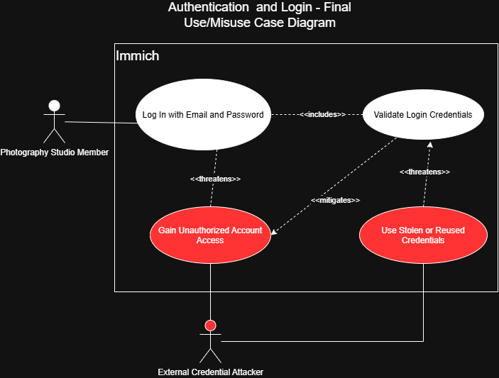

# Immich Use Case and Misuse Case Security Analysis

## Team Members

- Christian Theisen
- Adu
- Marc
- Matthew
- Dillon

---

## 1. Operational Context

This analysis builds upon the operational environment established in our project proposal for Immich. The system of interest is a self-hosted Immich deployment used by a five-person photography studio to manage, store, and share photos and videos.

### 1.1 System and Trust Boundaries

The security analysis considers interactions across the following system and trust boundaries:

- Internet
- Reverse proxy
- Immich application
- PostgreSQL database
- File storage
- External identity provider, where applicable

The PostgreSQL database and file storage are treated separately because the database contains application metadata and authentication-related information, while original photos and videos reside in file storage.

---

## 2. Essential Interactions and Use/Misuse Case Analysis

Five essential interactions between Immich and its operational environment were selected for use-case and misuse-case analysis.

### 2.1 Authentication and Login

**Owner:** Christian

#### Actors

**Photography Studio Member:** A member of the five-person photography studio who has an existing Immich account and uses the externally accessible Immich application to access the studio's photo-management functionality.

#### Use Case Description

The Authentication and Login use case represents a photography studio member accessing Immich using an existing account. The Photography Studio Member provides an email address and password through the Immich login interface. Immich validates the submitted credentials before granting authenticated access to the user's account and protected application functionality.

**Goal:** Authenticate to Immich and gain access to the member's authorized account and photo-management functionality.

**Precondition:** The Photography Studio Member has an existing Immich account with valid login credentials.

**Successful Outcome:** Immich validates the supplied credentials and establishes authenticated access for the Photography Studio Member.

#### Initial Use Case

The initial use-case analysis identified **Log In with Email and Password** as the primary interaction. The Photography Studio Member interacts with the Immich system through this use case to establish authenticated access.

The initial diagram intentionally represents only the legitimate interaction. Misusers, misuse cases, and security countermeasures are introduced during subsequent iterations of the analysis.

#### Misuser(s)

**External Credential Attacker:** An individual outside the photography studio who has network access to the studio's Internet-accessible Immich login interface. The attacker's motive is to obtain unauthorized access to a studio member's account and the photographs, metadata, or other resources available through that account. The attacker does not initially possess legitimate access to Immich but may obtain or discover a studio member's credentials through an external source, such as credential reuse or prior credential theft. The attacker can submit authentication requests through the same externally accessible login interface used by legitimate studio members.

#### Misuse Cases

**Gain Unauthorized Account Access:** The External Credential Attacker attempts to authenticate as a legitimate Photography Studio Member without authorization. This misuse case threatens the normal **Log In with Email and Password** use case.

**Use Stolen or Reused Credentials:** The External Credential Attacker submits credentials belonging to a legitimate Photography Studio Member. Because the supplied credentials may be valid, ordinary credential validation alone may not distinguish the attacker from the legitimate account owner. This misuse case therefore threatens the **Validate Login Credentials** security functionality.

#### Security Countermeasures

**Validate Login Credentials:** Immich validates the email address and password supplied during authentication before granting authenticated access. This security functionality mitigates attempts to gain unauthorized account access when an attacker supplies invalid credentials.

The analysis also identified a limitation of credential validation. If an attacker obtains valid credentials belonging to a Photography Studio Member, successful password validation alone cannot determine whether the person submitting those credentials is the legitimate account owner. This limitation motivated an additional misuse case rather than assuming that credential validation completely prevents unauthorized access.

#### Iterative Analysis

The Authentication and Login analysis was developed recursively by introducing threats and security functionality across multiple iterations.

**Initial Use Case:** The analysis began with the Photography Studio Member interacting with **Log In with Email and Password**. This established the legitimate interaction between an external actor and Immich.

**Iteration 1 – Unauthorized Account Access:** An **External Credential Attacker** and the misuse case **Gain Unauthorized Account Access** were introduced. The misuse case threatens the legitimate login use case and represents an external attacker attempting to authenticate as a studio member without authorization.

**Iteration 2 – Credential Validation:** The security functionality **Validate Login Credentials** was introduced. The **Log In with Email and Password** use case includes credential validation, which mitigates unauthorized-access attempts involving invalid credentials.

**Iteration 3 – Stolen or Reused Credentials:** The analysis was repeated against the newly identified security functionality. The misuse case **Use Stolen or Reused Credentials** was introduced because an attacker possessing valid credentials may successfully satisfy ordinary credential validation. This misuse case therefore threatens **Validate Login Credentials** and demonstrates that password validation does not completely eliminate the risk of account compromise.

The final diagram incorporates the legitimate actor, contextualized misuser, identified misuse cases, and security functionality discovered through this iterative process.

#### Final Use/Misuse Case Diagram

The final diagram incorporates the legitimate Authentication and Login interaction, the External Credential Attacker, the identified misuse cases, and the security functionality derived through iterative analysis.

#### Derived Security Requirements

The iterative misuse-case analysis produced the following functional security requirements for Authentication and Login:

- **SR-AUTH-01 – Credential Validation:** Immich shall validate the email address and password supplied by a user before establishing an authenticated session or granting access to protected application functionality.

- **SR-AUTH-02 – Authentication Failure:** Immich shall deny authentication when the supplied email address or password cannot be successfully validated.

- **SR-AUTH-03 – Authentication Failure Disclosure:** Immich shall avoid revealing whether an authentication failure resulted from an invalid email address or an invalid password, reducing information available for account-enumeration attacks.

- **SR-AUTH-04 – Authentication Event Logging:** Immich shall record failed authentication attempts with sufficient information to support security monitoring and investigation.

- **SR-AUTH-05 – Compromised Credential Risk:** Authentication controls should provide a means of reducing reliance on reusable application passwords because possession of a valid studio member's password may allow an unauthorized user to satisfy ordinary password validation.

#### Immich Implementation Evidence

The derived Authentication and Login requirements were compared against the current Immich implementation and official documentation.

| Requirement | Support | Immich Implementation Evidence |
| --- | --- | --- |
| **SR-AUTH-01** | Supported | Immich's authentication service retrieves the user by email and compares the submitted password with the stored password hash using bcrypt. A successful authentication results in creation of the login response and session. |
| **SR-AUTH-02** | Supported | If the user does not exist, has no password, or the password comparison fails, Immich rejects the request with an unauthorized response rather than establishing a session. |
| **SR-AUTH-03** | Supported | Immich returns the same "Incorrect email or password" response for unsuccessful password authentication. It also performs a bcrypt comparison against a dummy hash when an email is not registered to reduce timing-based user enumeration. |
| **SR-AUTH-04** | Supported | Immich records a warning for a failed login attempt containing the submitted email address and source IP address. |
| **SR-AUTH-05** | Partially Supported | Immich supports third-party authentication through OpenID Connect (OIDC) on top of OAuth2 and allows administrators to disable local password authentication. This provides a deployment option that can reduce reliance on Immich-managed reusable passwords. However, ordinary email/password authentication still relies on possession of valid credentials and does not by itself distinguish a legitimate user from an attacker who has obtained those credentials. |

Overall, Immich directly supports the credential-validation, authentication-failure, failure-disclosure, and failed-login logging requirements identified by this analysis. The compromised-credential requirement is only partially addressed by the availability of OAuth/OIDC and the ability to disable password authentication. The strength of authentication provided by an external identity provider depends on that provider's configuration and security controls.

---

### 2.2 Upload and Private Asset Access

**Owner:** Matthew

#### Actors

TBD

#### Use Case Description

TBD

#### Initial Use Case

TBD

#### Misuser(s)

TBD

#### Misuse Cases

TBD

#### Security Countermeasures

TBD

#### Iterative Analysis

TBD

#### Final Use/Misuse Case Diagram

*Diagram to be added.*

#### Derived Security Requirements

TBD

#### Immich Implementation Evidence

TBD

---

### 2.3 Shared Albums and Public Links

**Owner:** Dillon

#### Actors

TBD

#### Use Case Description

TBD

#### Initial Use Case

TBD

#### Misuser(s)

TBD

#### Misuse Cases

TBD

#### Security Countermeasures

TBD

#### Iterative Analysis

TBD

#### Final Use/Misuse Case Diagram

*Diagram to be added.*

#### Derived Security Requirements

TBD

#### Immich Implementation Evidence

TBD

---

### 2.4 Administrative Access and User Management

**Owner:** Marc

#### Actors

TBD

#### Use Case Description

TBD

#### Initial Use Case

TBD

#### Misuser(s)

TBD

#### Misuse Cases

TBD

#### Security Countermeasures

TBD

#### Iterative Analysis

TBD

#### Final Use/Misuse Case Diagram

*Diagram to be added.*

#### Derived Security Requirements

TBD

#### Immich Implementation Evidence

TBD

---

### 2.5 OAuth/OIDC and External Authentication

**Owner:** Adu

#### Actors

TBD

#### Use Case Description

TBD

#### Initial Use Case

TBD

#### Misuser(s)

TBD

#### Misuse Cases

TBD

#### Security Countermeasures

TBD

#### Iterative Analysis

TBD

#### Final Use/Misuse Case Diagram

*Diagram to be added.*

#### Derived Security Requirements

TBD

#### Immich Implementation Evidence

TBD

---

## 3. Consolidated Security Requirements

The following table consolidates the functional security requirements derived from the five misuse-case analyses and maps them to the threats and security controls that motivated them.

| ID | Security Requirement | Derived From | Security Property / Control | Immich Support | Evidence |
|---|---|---|---|---|---|
| SR-AUTH-01 | TBD | Authentication/Login | TBD | TBD | TBD |
| SR-ASSET-01 | TBD | Private Asset Access | TBD | TBD | TBD |
| SR-SHARE-01 | TBD | Shared Links | TBD | TBD | TBD |
| SR-ADMIN-01 | TBD | Administrative Access | TBD | TBD | TBD |
| SR-OIDC-01 | TBD | OAuth/OIDC | TBD | TBD | TBD |

---

## 4. AI-Assisted Use/Misuse Case Analysis

### 4.1 Prompt Used

TBD

### 4.2 Suggestions Produced

TBD

### 4.3 Improvements Made to the Diagrams

TBD

### 4.4 Usefulness and Limitations

TBD

---

## 5. Alignment with Immich Security Features

### 5.1 Supported Security Requirements

TBD

### 5.2 Partially Supported Security Requirements

TBD

### 5.3 Identified Security Gaps

TBD

### 5.4 Sufficiency of Existing Security Features

TBD

---

## 6. Security Configuration and Installation Documentation Review

### 6.1 Existing Security Guidance

TBD

### 6.2 Missing or Unclear Security Guidance

TBD

### 6.3 Recommended Documentation Improvements

TBD

---

## 7. Project Management and Collaboration

### 7.1 GitHub Project Board

[Immich Project Board](ADD_PROJECT_BOARD_LINK_HERE)

### 7.2 Team Task Assignments

| Team Member | Primary Responsibility | Secondary Responsibility |
|---|---|---|
| Christian | Authentication/Login | Report integration and project board |
| Matthew | Upload and Private Asset Access | Implementation verification |
| Dillon | Shared Albums and Public Links | Security requirements compilation |
| Marc | Administrative Access and User Management | Diagram consistency review |
| Adu | OAuth/OIDC and External Authentication | Security documentation review |

### 7.3 Team Collaboration

TBD

---

## 8. Team Reflection

### Christian

TBD

### Adu

TBD

### Marc

TBD

### Matthew

TBD

### Dillon

TBD

### 8.1 Combined Team Reflection

TBD

---

## References

- Immich. "Auth Service." *Immich GitHub Repository*.  
  https://github.com/immich-app/immich/blob/main/server/src/services/auth.service.ts

- Immich. "OAuth." *Immich Documentation*.  
  https://docs.immich.app/administration/oauth/

- Immich. "System Settings." *Immich Documentation*.  
  https://docs.immich.app/administration/system-settings/
